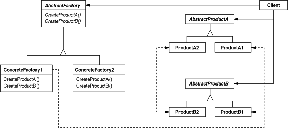

<h3>Intent</h3>

Provide an interface for creating families of related or dependent objects
without specifying their concrete classes.

<h3>Motivation</h3>

Want to support a user interface with multiple "look-and-feel" standards.
An application should not hard code its widgets for a particular look and feel.

Define an abstract widget factory that declares an interface for creating each kind
of widget, the concrete subclasses implement the widgets for a particular look and feel.

<h3>Applicability</h3>

Use the abstract factory when
* A system should be independent of how its products are created, composed and represented
* A system should be configured with one of multiple families of products.
* A family of related product objects is designed to be used together, and you need to enforce this constraint.
* You want to provide a class library of products, and you want to reveal just their interfaces, not their implementations.

