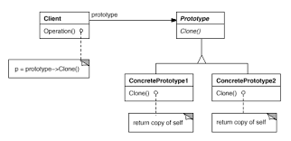

<h3>Intent</h3>

Specify the kinds of objects to create using a prototypical instance, 
and create new objects by copying this prototype. 

<h3>Motivation</h3>

Have a GraphicTool framework that can draw graphics to the screen.
Imagine we want to make a musical editor application to use the GraphicTool 
framework to draw our custom graphics, but the GraphicTool has no knowledge of 
which classes we want to add since its part of an external library. 

Solution: If the GraphicTool has the ability to create a new Graphic by "cloning"
an instance of the Graphic subclass. The instance to clone is called a "prototype".

<h3>Applicability</h3>

Use the prototype when a system should be independent of how its products 
are created, composed, represented and: 
* when the classes to instantiate are specified at run-time, or
* to avoid building class hierarchies of factories that parallel the class hierarchy of products, or
* when instances of a class can have one of only a few different combinations of state.