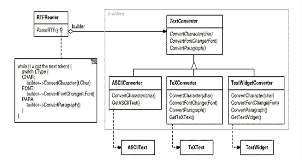
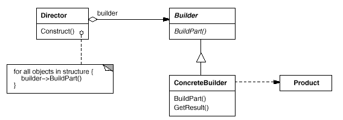

<h3>Intent</h3>

Separate the construction of a complex object from its representation 
so that the same construction process can create different representations.

<h3>Motivation</h3>

RTFReader uses TextConverter interface whose subclasses know how to convert different formats.
Each converter puts the mechanism for defining and creating complex objects behind
an interface.

<h3>Applicability</h3>
The algorithm for creating a complex object should be independent of the parts
that make up the object and how they're assembled.

The construction process must allow different representations for the object that's constructed.

