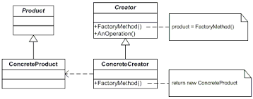

<h3>Intent</h3>

Define an interface for creating an object, but let subclasses decide which class to 
instantiate. Factory Method lets a class defer instantiation to subclasses.

<h3>Motivation</h3>

An application framework may wish to present different kinds of documents to the user.
The framework presents two abstract classes, the application and the document.
Clients have to subclass these classes to get application specific implementations.

The application however, doesn't know what kind of classes are required, it just 
knows when it should create the objects, on "new document" or "new drawing". 

The factory method encapsulates the knowledge of which document subclass 
to create and moves this knowledge out of the framework. 

<h3>Applicability</h3>

Use the factory method when
* a class can't anticipate the class of objects it must create
* a class wants its subclasses to specify the objects it creates
* classes delegate responsibility to one of several helper subclasses,
* and you want to localize the knowledge of which helper subclass is the delegate.

